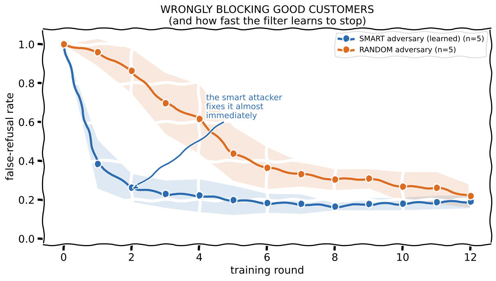
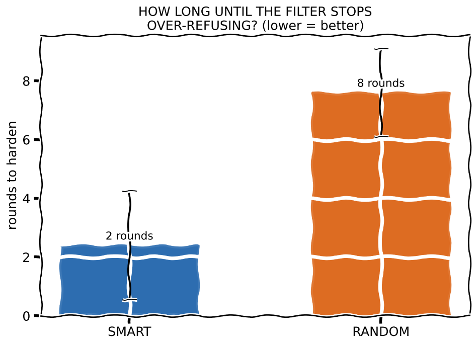
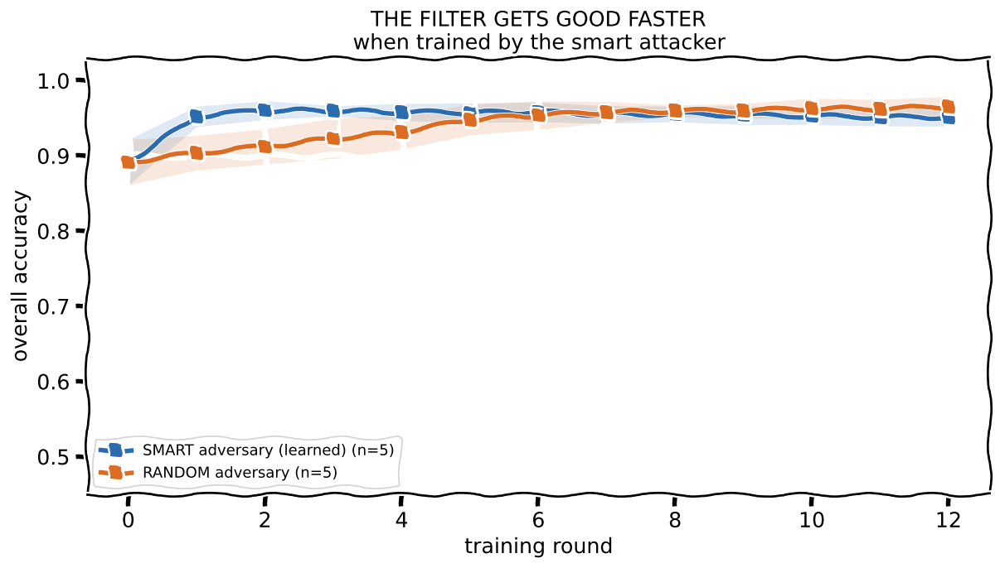
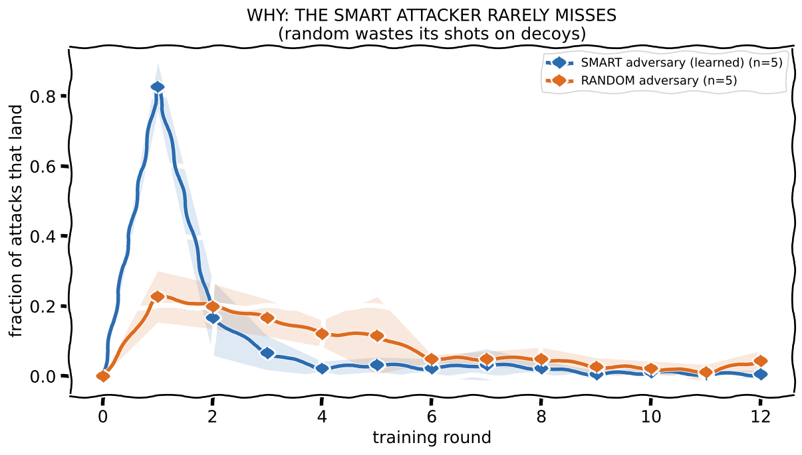
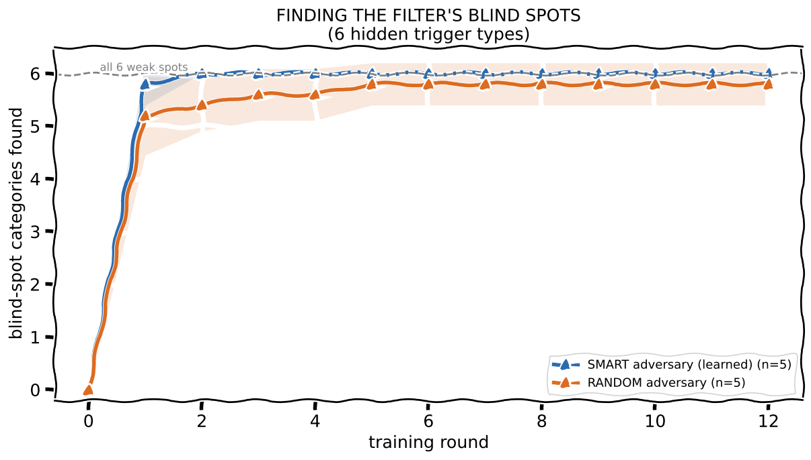

# Loophole v2 — adversarially-mined boundary data for safety classifiers

A safety **classifier** (the "allow / block" filter in front of a chatbot) is only as good as the
examples near its **decision boundary** — the tricky, adversarial cases. Loophole v2 generates that
boundary data **adversarially and continuously**: a learned attacker probes the *current*
classifier for blind spots, and the classifier retrains on what it finds. They co-evolve, and the
data concentrates exactly where it matters.

The twist that makes it work without a judge: the attacker can only choose
`request × intent-preserving-transforms` from a fixed toolbox, so **every generated example's label
is known by construction** — no model in the loop deciding "is this still malicious?".

## The headline result

**Does a *learned* attacker train a better classifier than *random* search?** Yes — and much
faster. On a false-refusal task (benign requests dressed up to look policy-violating, which a naive
filter wrongly blocks), trained against a learned (GRPO) attacker vs. a random one, 5 seeds each:



The learned attacker drives wrongful blocking of good customers to its floor by **round 2**; random
search takes **~8 rounds**.




**Why:** the learned attacker's attacks *land* ~90% of the time and it finds all of the filter's
blind spots within ~2 rounds; random wastes most of its attempts on decoys and covers them slowly.




**One line:** a learned attacker concentrates effort on the classifier's *actual* blind spots, so
it hardens the classifier with far fewer rounds of data than random search.

## The idea: labels by construction

The trap in adversarial data generation is circularity — if you need an LLM to *judge* whether an
attack is still malicious, that judge *is* the classifier you're building. Loophole v2 avoids judges
by constraining the attacker to a toolbox where the label is automatic:

- **Payloads (P)** — out-of-policy requests. Malicious by construction → **BLOCK**.
- **Benign seeds (B)** — in-policy requests. Benign by construction → **ALLOW**.
- **Transforms (T)** — intent-preserving rewrites. Defined *not* to change the class.

The attacker only picks `base × transform-stack`, so every example carries a trusted label and the
reward is **verifiable** — the regime where RL is stable. The attacker can't win by drifting benign
(the label flips with it).

## How it works

| piece | file | role |
|---|---|---|
| Constitution | `constitutions/*.yaml` | the policy: payloads, benign seeds, transforms, train/held-out splits |
| Toolbox | `loophole_v2/toolbox.py` | transforms + deterministic `render(action) → (prompt, label)` — the label source of truth |
| Adversary G | `loophole_v2/adversary.py` | Qwen3.5-9B (LoRA) policy; emits a JSON action selecting a transform stack |
| Classifier C | `loophole_v2/classifier.py` | the filter we ship (small Qwen seq-classifier, or a bag-of-words model) |
| Reward | `loophole_v2/reward.py` | `margin + bonus·[crossed boundary] + λ·novelty` (fool it, actually cross, stay diverse) |
| GRPO | `loophole_v2/grpo.py` | hand-rolled group-relative policy optimization (no critic; KL via LoRA-disable) |
| Loop | `loophole_v2/loop.py` | the outer min-max: hunt blind spots → mine → retrain → repeat |

The adversary is trained with **GRPO**: sample a group of attacks for a goal, score each by the
reward (using C's own probabilities — no judge), normalize rewards within the group into advantages,
policy-gradient. LoRA makes it fit on one H100, and the KL leash to the base model is free (disable
the adapter to read base log-probs).

## Run it

```bash
uv sync
export HF_HOME=/path/to/hf_cache

# the headline experiment (learned vs random adversary), one seed:
python scripts/experiment_fr.py runs/grpo_s0 grpo 0      # learned attacker (needs a GPU)
python scripts/experiment_fr.py runs/greedy_s0 greedy 0  # random baseline (CPU)

# average over seeds and draw the plots:
python scripts/plot_fr.py 5
```

Swap `constitutions/sample_safety.yaml` for your own policy to target a different domain.

## Honest scope — *when* learned beats random

This is not a free lunch; finding the regime is part of the result:

- **It needs a large, diluted attack space.** On a tiny toolbox, random search covers everything in
  1–2 rounds and the learned attacker has no edge.
- **It needs a coverage-hungry classifier.** A model that generalizes "ignore the decoration" from a
  couple of examples removes the advantage — data quality stops mattering.
- **It needs diversity in the reward.** With a pure fooling reward the attacker mode-collapses onto
  one trick, and random search's natural diversity wins. The novelty term is essential.
- **Encoding attacks are unlearnable for an input-only classifier.** Base64 etc. fool the filter by
  *destroying* the information, so the only "defense" is to over-block — which is exactly the
  motivation for exchange-level (input + output) classifiers.

These conditions — rare-but-diverse attacks, a coverage-hungry learner — are precisely when *learned
boundary-mining* is worth more than *random generation*.

## Lineage

This builds on Loophole v1 (constitution → adversarial agents → patch the system prompt) and is
inspired by Anthropic's *Constitutional Classifiers*; the contribution is making the
boundary-data generation **adversarial, learned, and continuous**, with construction-guaranteed
labels instead of an LLM judge.
